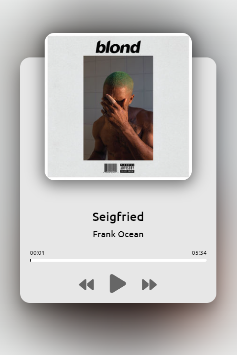

### Music Player App
This code is for a basic music player that handles audio playback in a web environment. It lets users interact with the audio player by controlling the playback (play/pause), skipping to the next or previous track, and visualizing the song's progress. The player also updates and displays the song’s title, artist, and album cover dynamically.

Made with javascript.

tutorial project made by: https://www.youtube.com/@AsmrProg

# Screenshot
Here we have project screenshot :

